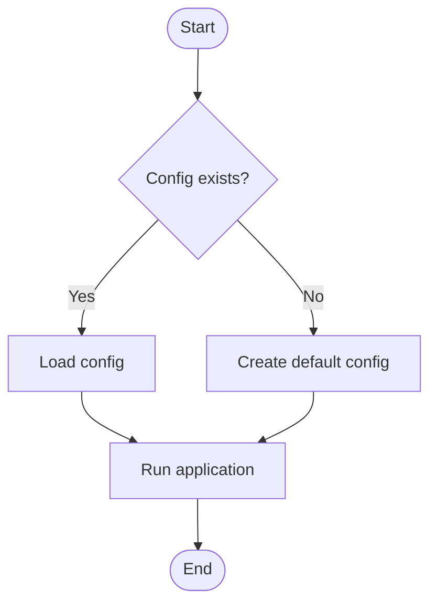
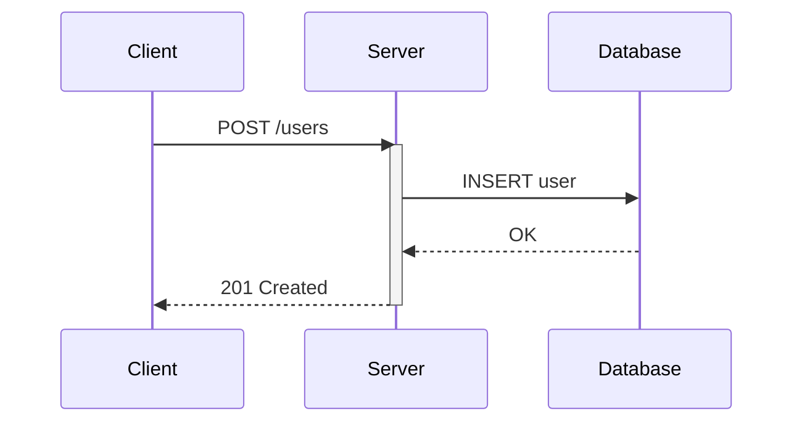
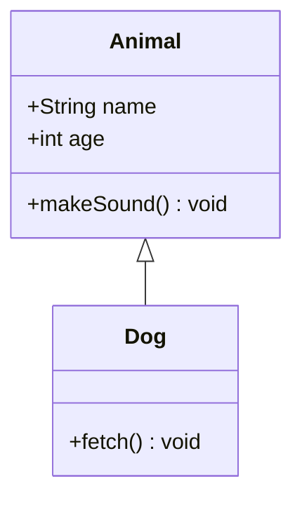
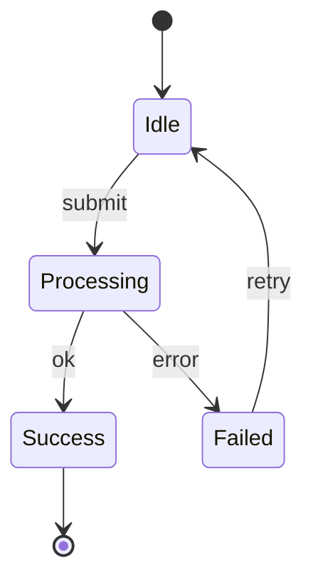
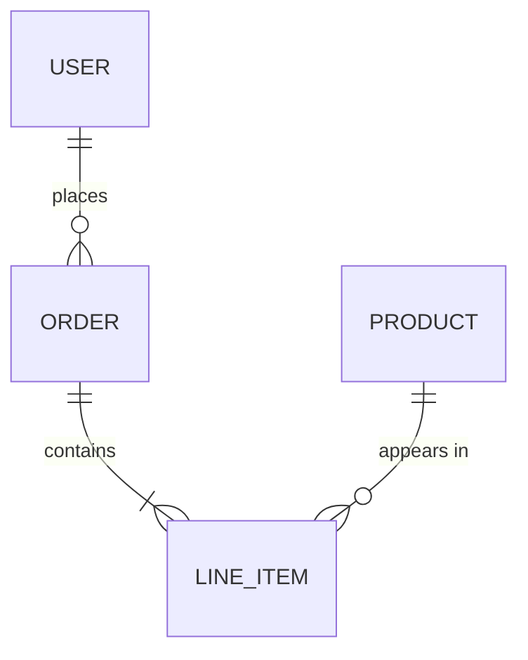
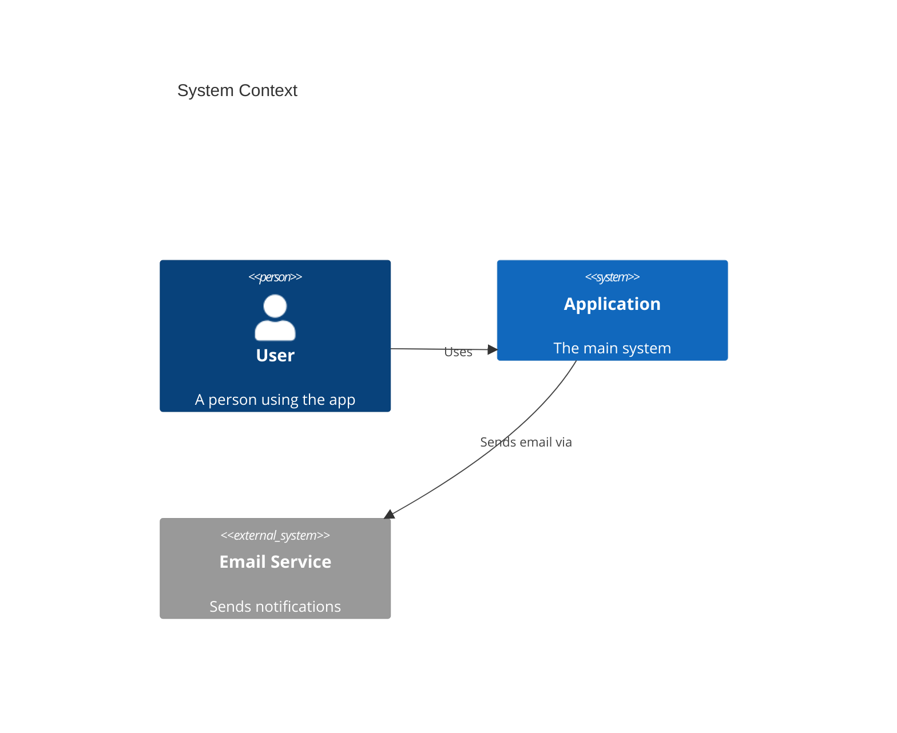

# Mermaid Diagram Skill

You create Mermaid diagrams that communicate clearly and render without errors.

## When to Add a Diagram

Add a diagram when it would genuinely help the reader. Good triggers:

- A process has more than two decision points or branches.
- A system has three or more components that interact.
- A state machine governs behavior that is hard to describe in prose.
- Data flows through multiple stages or services.
- Class or entity relationships are central to the explanation.

Do not add a diagram when a short paragraph or a bullet list communicates the same thing more clearly.

## Choosing the Right Diagram Type

| Situation | Diagram type | Mermaid keyword |
|---|---|---|
| Steps, decisions, branching logic | Flowchart | `flowchart TD` or `flowchart LR` |
| Messages between actors over time | Sequence diagram | `sequenceDiagram` |
| Object structure and relationships | Class diagram | `classDiagram` |
| Lifecycle with discrete states | State diagram | `stateDiagram-v2` |
| Database or domain model | ER diagram | `erDiagram` |
| High-level system architecture | C4 Context / Container | `C4Context` or `C4Container` |
| Time-ordered tasks or milestones | Gantt chart | `gantt` |
| User journey through a feature | User journey | `journey` |
| Git branching strategy | Git graph | `gitGraph` |
| Logical grouping or sets | Mindmap | `mindmap` |
| Data pipeline or ETL | Flowchart (LR) | `flowchart LR` |

When unsure, default to a flowchart — it is the most universally understood.

## Syntax Rules

Follow these rules to produce diagrams that render correctly on GitHub, GitLab, VS Code preview, and common doc sites.

### General

- Wrap every diagram in a fenced code block with the `mermaid` language tag.
- Start with the diagram keyword and direction on the first line inside the block.
- Keep node IDs short, lowercase, alphanumeric with underscores. Avoid special characters.
- Use square brackets `[Label text]` for process nodes, curly braces `{Label text}` for decisions, round parens `(Label text)` for start/end, and double brackets `[[Label text]]` for subroutines.
- Put human-readable labels in the brackets; keep IDs as terse identifiers.

### Edges

- Use `-->` for solid arrows, `-.->` for dashed arrows, `==>` for thick arrows.
- Add edge labels with `-->|label text|` syntax.
- Keep edge labels under five words.

### Flowcharts

### Sequence Diagrams

- Declare participants explicitly to control ordering.
- Use `activate` / `deactivate` to show lifelines.
- Use `alt` / `else` / `end` for conditional flows and `loop` / `end` for repetition.
- Prefer short participant aliases.

### Class Diagrams

- List attributes and methods inside the class block.
- Use standard relationship arrows: `<|--` inheritance, `*--` composition, `o--` aggregation, `-->` association.

### State Diagrams

- Use `[*]` for start and end pseudo-states.
- Name states with PascalCase or short labels.
- Use `-->` for transitions with optional labels after a colon.

### ER Diagrams

- Use the `||--o{` / `}o--||` notation for cardinality.
- Keep entity and attribute names concise.

### C4 Diagrams

- Use `C4Context` for the highest level and `C4Container` for zooming in.
- Define boundaries, systems, containers, and relationships.

## Style Guidelines

1. **Direction** — Use `TD` (top-down) for hierarchies and process flows. Use `LR` (left-right) for timelines, pipelines, and sequence-like flows.
2. **Size** — Keep diagrams under 15 nodes. If a diagram grows beyond that, split it into multiple diagrams or use subgraphs.
3. **Subgraphs** — Group related nodes with `subgraph` blocks and give each a clear title.
4. **Color and theming** — Do not add custom styles or theme overrides unless the user asks. Default rendering is the most portable.
5. **Labels** — Every node must have a human-readable label. Every edge that is not self-evident should have a short label.
6. **Consistency** — Within a single document, use the same diagram direction, naming conventions, and label style.

## Verification Checklist

Before finalizing any diagram:

- [ ] The fenced code block uses the `mermaid` language tag.
- [ ] The first line inside the block is the diagram keyword (e.g., `flowchart TD`).
- [ ] All node IDs are valid (alphanumeric + underscores, no spaces).
- [ ] Every opening subgraph has a matching `end`.
- [ ] Edge syntax is correct (`-->`, `-.->`, `==>` with optional `|label|`).
- [ ] The diagram has fewer than 15 nodes, or is split into sub-diagrams.
- [ ] Labels are concise and free of jargon the target audience would not know.
- [ ] The diagram adds value that prose alone does not provide.
